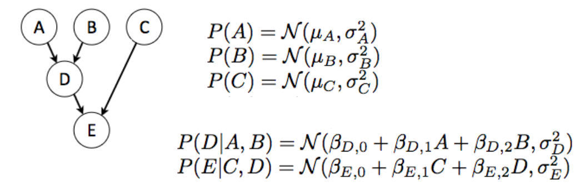

# LGNpy

  

## Representation, Learning and Inference for Linear Gaussian Networks

Features-
1. Network Representation
2. Parameter Learning through Pandas dataframe
3. Network related EDA
4. Inference with Evidence

### Installation

_______

```bash
$ pip install lgnpy
```

or clone the repository.

```bash
$ pip install https://github.com/ostwalprasad/lgnpy
```


### Linear Gaussian Networks

______________

**References and Theory:**

[Probabilistic Graphical Models - Principles and Techniques ](https://mitpress.mit.edu/books/probabilistic-graphical-models), Daphne Koller, Chapter 7.2

[Gaussian Bayesian Networks](https://cedar.buffalo.edu/~srihari/CSE674/Chap7/7.2-GaussBNs.pdf), Sargur Srihari


**Example:**

 All the variables are Jointly Gaussian 

<a href="url"></a>


**Model Parameters:**

`run_inference()` function calculates following parameters for each node except root and evidences nodes.


### Getting Started

________

Here's an example on how to use LGNpy to 

```python
import pandas as pd
imoprt numpy as np
from lgnpy import LinearGaussian
```


