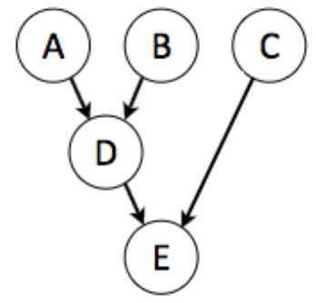
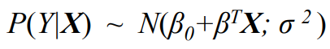
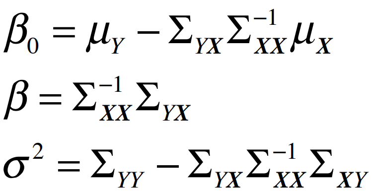
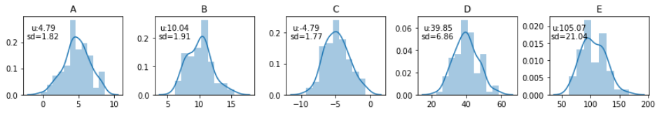
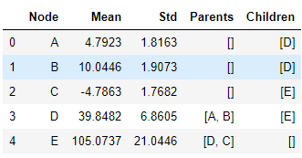
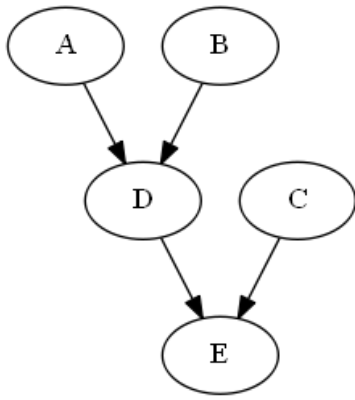

# LGNpy

   [](https://lgnpy.readthedocs.io/en/latest/?badge=latest) [](https://codecov.io/gh/ostwalprasad/LGNpy)

## Representation, Learning and Inference for Linear Gaussian Bayesian Networks

LGNs are Bayesian Networks where all the nodes have continuous data. Gaussians are surprisingly good approximation for many real world continuous distributions. This package helps in modelling the network, learning parameters through data and running inference with evidence(s)

## Installation
```bash
$ pip install lgnpy
```

or clone the repository.

```bash
$ pip install https://github.com/ostwalprasad/lgnpy
```


## Getting Started

#### 	1. Create Network



```python
import pandas as pd
import numpy as np
from lgnpy import LinearGaussian

lg = LinearGaussian()
lg.set_edges_from([('A', 'D'), ('B', 'D'), ('D', 'E'), ('C', 'E')])
```

####	2 Create Data and assign to it to network.

​	Create synthetic data for network using pandas and bind network with the data. There's no need to separately calculate means and covariance matrix.

```python
np.random.seed(42)
n=100
data = pd.DataFrame(columns=['A','B','C','D','E'])
data['A'] = np.random.normal(5,2,n)
data['B'] = np.random.normal(10,2,n)
data['D'] = 2*data['A'] + 3*data['B'] + np.random.normal(0,2,n)
data['C'] = np.random.normal(-5,2,n)
data['E'] = 3*data['C'] + 3*data['D'] + np.random.normal(0,2,n)

lg.set_data(data)
```

####	3. Set Evidence(s)

 Evidence are optional and can be set before running inference.

```python
 lg.set_evidences({'A':5,'B':10})
```

####	4. Run Inference 

For each node, CPT (Conditional Probability Distribution) is defined as::<br/>

<br/>

where, its parameters  are calculated using conditional distribution of parent(s) and nodes: <br/>

 <br/>

`run_inference()` returns inferred means and variances of each nodes.

   ```python
lg.run_inference(debug=False)
   ```

   

## Additional Functions:

```python
lg.plot_distributions(save=False)
```
 <br/>

```python
lg.network_summary()
```
<br/> <br/>

```python
lg.draw_network(filename='sample_network',open=True)
```
<br/> <br/>

## Example

Example Notebook [here](https://github.com/ostwalprasad/LGNpy/blob/master/examples/lgnpy_example.ipynb)

## References:

[Probabilistic Graphical Models - Principles and Techniques ](https://mitpress.mit.edu/books/probabilistic-graphical-models), Daphne Koller, Chapter 7.2

[Gaussian Bayesian Networks](https://cedar.buffalo.edu/~srihari/CSE674/Chap7/7.2-GaussBNs.pdf), Sargur Srihari

## License

MIT License Copyright (c) 2020, Prasad Ostwal

